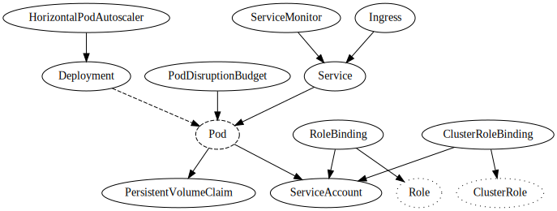
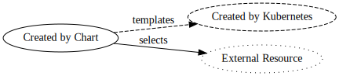

# Generic Service Helm Chart

This Helm chart simplifies deploying a typical "80% case" service on Kubernetes. It takes care of creating [Resources](#resources) such as `Deployment`, `Service` and `Ingress`, configured via a few required and many optional [Values](#values).

## Getting started

To be able to use this Charts you must first run:

    helm repo add axoom-github https://axoom.github.io/charts/

You can usually delete your entire `templates` directory when using this chart. Pull it in to your Chart as a dependency by adding this to your `requirements.yaml`:

```yaml
dependencies:
  - name: generic-service
    version: 5.2.0
    repository: '@axoom-github'
    alias: app
```

You can then add static configuration to your `values.yaml` like this:

```yaml
app:
  name: myservice

  image:
    registry: eu.gcr.io
    repository: axoom-image/myteam/myservice

  env:
    SOME_CONFIG: some-value

  resources:
    requests:
      memory: 256M
    limits:
      memory: 512M

  replicas: 2
```

## Values

| Value                                     | Default                 | Description                                                                                               |
|-------------------------------------------|-------------------------|-----------------------------------------------------------------------------------------------------------|
| `global.tenant.id`                        |                         | The tenant's id (used for labeling)                                                                       |
| `name`                                    | __required__            | The name of the service                                                                                   |
| `image.registry`                          | __required__            | The Registry containing the Docker Image to run (also used as the name of an optional Image Pull Secret)  |
| `image.repository`                        | __required__            | The name of the Docker Image image to run (without the Registry)                                          |
| `image.tag`                               | __required__            | The tag of the Docker Image to run                                                                        |
| `image.pullPolicy`                        | `IfNotPresent`          | Set to `Always` to try to pull new versions of the Docker Image                                           |
| `env`                                     | `{}`                    | The environment variables passed to the service                                                           |
| `resources.requests`                      | `{memory: 64M}`         | The minimum resources requested/reserved for the service                                                  |
| `resources.limits`                        | `{memory: 128M}`        | The maximum resources the service can use                                                                 |
| `replicas`                                | `1`                     | The number of instances of the service to run (set at least `2` for Pod Disruption Budget)                |
| `autoscaling.enabled`                     | `false`                 | Enables automatic starting of additional instances based on CPU load                                      |
| `autoscaling.maxReplicas`                 | `3`                     | The maximum number of instances to run (must be larger than `replicas`)                                   |
| `autoscaling.targetCpu`                   | `50`                    | The desired average CPU load in percent                                                                   |
| `rollingUpdate`                           | `true`                  | Controls whether to wait for new versions to be up and running before shutting down old version           |
| `nodeSelector`                            | `{}`                    | Node labels required for scheduling this service, also used as tolerations                                |
| `persistence.enabled`                     | `false`                 | Enables persistent storage for the service                                                                |
| `persistence.storageClass`                | `standard`              | The type of disk to use for storage (e.g., `standard` or `ssd`)                                           |
| `persistence.size`                        | `1G`                    | The size of the persistent volume to create for the service                                               |
| `persistence.mountPath`                   | __required if enabled__ | The mount path for the storage inside the container                                                       |
| `secrets[].name`                          | __required if used__    | The name of the Kubernetes Secret                                                                         |
| `secrets[].mountPath`                     | __required if used__    | The mount path for the Secret inside the container                                                        |
| `secrets[].subPath`                       |                         | The path of a single file in the secret relative to the given `mountPath`                                 |
| `secrets[].files`                         |                         | Secret content as map of file names to base64-encoded content; leave empty to reference existing secret   |
| `ingress.enabled`                         | `false`                 | Enables HTTP ingress into the service                                                                     |
| `ingress.port`                            | `80`                    | The container port ingress traffic is routed to                                                           |
| `ingress.class`                           | `traefik-public`        | Specifies the ingress controller to use; `cluster` for cluster-internal access with no ingress controller |
| `ingress.domain`                          | __required if enabled__ | The domain name under which the service is exposed (not for `cluster`)                                    |
| `ingress.additionalDomains`               | `[]`                    | Additional domain names under which the service is exposed (not for `cluster`)                            |
| `ingress.annotations`                     | `{}`                    | Additional annotations besides the ingress class to be added to the ingress  (not for `cluster`)          |
| `ingress.tls`                             | `{}`                    | Specifies the TLS configuration for the ingress (not for `cluster`)                                       |
| `livenessProbe`                           |                         | Probe that causes the service to be restarted when failing                                                |
| `readinessProbe`                          |                         | Probe that prevents the service from receiving traffic when failing                                       |
| `monitoring.enabled`                      | `true`                  | Enables Prometheus monitoring                                                                             |
| `monitoring.port`                         | `5000`                  | The port which is scraped for monitoring data                                                             |
| `alerting.enabled`                        | `false`                 | Enables generic alert rules (unavailable pods, high memory usage, HTTP 4xx/5xx responses, slow responses) |
| `alerting.labels`                         | `{}`                    | Labels to apply to generic alert rules in addition to `component` and `severity`                          |
| `alerting.memoryUsage.thresholdFactor`    | `0.9`                   | The maximum factor (between `0` and `1`) of memory usage allowed                                          |
| `alerting.http4xxRatio.sampleInterval`    | `5m`                    | The time interval in which to measure ratio of HTTP 4xx responses for the current state                   |
| `alerting.http4xxRatio.referenceInterval` | `1d`                    | The time interval in which to measure ratio of HTTP 4xx responses as a reference for the normal state     |
| `alerting.http4xxRatio.thresholdFactor`   | `1.5`                   | The maximum factor between the current state and the normal state of HTTP 4xx response ratio allowed      |
| `alerting.responseTime.sampleInterval`    | `1h`                    | The time interval in which to measure average HTTP response times for the current state                   |
| `alerting.responseTime.referenceInterval` | `1d`                    | The time interval in which to measure average HTTP response times for the normal state                    |
| `alerting.responseTime.thresholdFactor`   | `1.5`                   | The maximum factor between the current state and the normal state of HTTP response times allowed          |
| `sidecars`                                | `[]`                    | Additional sidecar containers to be added to the Pod                                                      |
| `rbac.roles`                              | `[]`                    | Namespace-specific Kubernetes RBAC Roles to assign to the service                                         |
| `rbac.clusterRoles`                       | `[]`                    | Cluster-wide Kubernetes RBAC Roles to assign to the service                                               |

## Environment variables

In addition to the environment variables specified via the `env` value, the following dynamic environment variables are automatically set:

| Value       | Description                                           |
|-------------|-------------------------------------------------------|
| `POD_NAME`  | The name of the Kubernetes pod                        |
| `POD_IP`    | The cluster-internal IP of the Kubernetes pod         |
| `NODE_NAME` | The name of the Kubernetes node the pod is running on |

## Resources

This Helm chart generates a number of Resources based on the specified [Values](#values). These resources reference each other:



Legend:  


**Deployment**  
Instructs Kubernetes to create a certain number of `Pod`s (`replicas`) running a specific `image`.

**Service**  
Created if `ingress.enabled` or `monitoring.enabled`.

**Ingress**  
Created if `ingress.enabled` and `ingress.class` is not `cluster`.

**ServiceMonitor**  
Created if `monitoring.enabled`.

**PrometheusRule**  
Created if `alerting.enabled`.

**PersistentVolumeClaim**  
Created if `persistence.enabled`.

**ServiceAccount**  
Created if `rbac.roles` and/or `rbac.clusterRoles` is not empty.

**RoleBinding**  
Created once for every entry in `rbac.roles`.

**ClusterRoleBinding**  
Created once for every entry in `rbac.clusterRoles`.

**PodDisruptionBudget**  
Created if `replicas` is greater than `1`.

**HorizontalPodAutoscaler**  
Created if `autoscaling.enabled`.
