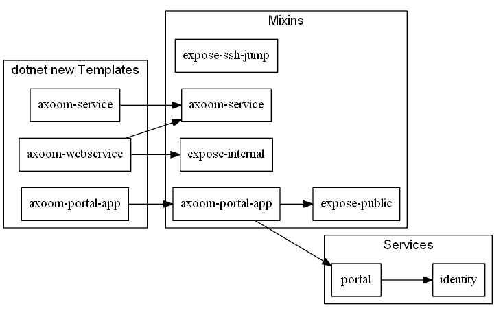

# AXOOM Platform Base Assets

This repository contains [ax Asset Descriptors](https://tfs.inside-axoom.org/tfs/axoom/axoom/_git/Axoom.Provisioning?_a=readme&fullScreen=true) for basic infrastructure components and Mixins.

Mixins allow you define and enforce the intended 
structure, make sure you don't forget about required settings and - maybe most 
importantly - allow us to follow *convention over configuration* by bringing 
things together in a predictable way.

## AXOOM Service Mixin

This mixin creates a container for running an (usually .NET Core-based) AXOOM Service.

**Feed URI**: http://assets.axoom.cloud/mixins/axoom-service.xml

**Parameters:**

| Name | Description|
| -- | -- |
| `SERVICE_NAME` | The name for the Docker service. |
| `DOCKER_REGISTRY` | The host name of the Docker Registry holding the image. |
| `VERSION` | The version number of the service. |

**Docker Image:** `{DOCKER_REGISTRY}/services/{SERVICE_NAME}:{VERSION}`

**Usage sample:**

```yml
mixins:
  - feed_uri: http://assets.axoom.cloud/mixins/axoom-service.xml
    parameters:
      SERVICE_NAME: myservice
      DOCKER_REGISTRY: <DOCKER_REGISTRY>
      VERSION: <VERSION>
```

## AXOOM Portal App Mixin

This mixin creates a container for running an (usually ASP .NET Core-based) AXOOM Portal App. Injects the App's metadata into the Portal and Identity Server using environment variables.

**Feed URI**: http://assets.axoom.cloud/mixins/axoom-portal-app.xml

**Parameters:**

| Name | Description|
| -- | -- |
| `APPKEY` | The name for the Docker service and subdomain. |
| `DOCKER_REGISTRY` | The host name of the Docker Registry holding the image. |
| `VERSION` | The version number of the service. |
| `PORTAL_APP` | A JSON document describing the App's presence in the Portal. |
| `IDENTITY_CLIENT` | A JSON document describing the App's client in the Identity Server. |

**Docker Image:** `{DOCKER_REGISTRY}/apps/{APPKEY}:{VERSION}`

**Usage sample:**

```yml
mixins:
  - feed_uri: http://assets.axoom.cloud/mixins/axoom-portal-app.xml
    parameters:
      APPKEY: axoom-myapp
      DOCKER_REGISTRY: <DOCKER_REGISTRY>
      VERSION: <VERSION>
      PORTAL_APP: <PORTAL_APP>
      IDENTITY_CLIENT: <IDENTITY_CLIENT>
```


## Expose Public HTTP(S) Mixin

This mixin exposes a service to public HTTP(S) traffic.

**Feed URI**: http://assets.axoom.cloud/mixins/expose-public.xml

**Parameters:**

| Name | Description|
| -- | -- |
| `SERVICE_NAME` | The name for the Docker service and subdomain. |
| `PORT` | The port number the service (inside the container) is listening on. |

**Usage sample:**

```yml
mixins:
  - feed_uri: http://assets.axoom.cloud/mixins/expose-public.xml
    parameters:
      SERVICE_NAME: myservice
      PORT: 80
```


## Expose Internal HTTP Mixin

This mixin exposes a service to internal HTTP traffic for management purposes. Applies HTTP Basic Auth protection.

**Feed URI**: http://assets.axoom.cloud/mixins/expose-internal.xml

**Parameters:**

| Name | Description|
| -- | -- |
| `SERVICE_NAME` | The name for the Docker service and subdomain. |
| `PORT` | The port number the service (inside the container) is listening on. |

**Usage sample:**

```yml
mixins:
  - feed_uri: http://assets.axoom.cloud/mixins/expose-internal.xml
    parameters:
      SERVICE_NAME: myservice
      PORT: 80
```


## Expose SSH Jump Mixin

This mixin exposes a service to traffic tunneled via an SSH Jump Host for management purposes.

**Feed URI**: http://assets.axoom.cloud/mixins/expose-ssh-jump.xml

**Parameters:**

| Name | Description|
| -- | -- |
| `SERVICE_NAME` | The name for the Docker service. |

**Usage sample:**

```yml
mixins:
  - feed_uri: http://assets.axoom.cloud/mixins/expose-ssh-jump.xml
    parameters:
      SERVICE_NAME: myservice
```



